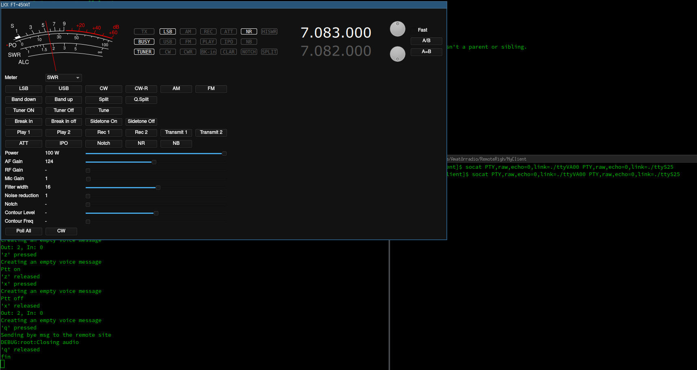

# LKXRRC - Unofficial python client for microbit remoterig RRC-1258
I've written this as a proof-of-concept client to control my Yaesu FT-450AT using python on a linux laptop.
It is by no means polished or finished, and is not in any way affiliated with or supported by microbit.

## Inspiration
I think the remoterig setup is great and I'm mostly using the hardware client.
While travelling I'm also using the RRC micro, but while it does a good job it is not perfect for me.

I was inspired to write this client because I want:

1. Linux support - RRC micro is currently my only reason to keep windows around.
2. Modern audio drivers - The RRC micro has issues with my soundcards.
3. Straight key support - I want to be able to use a straight key.
4. Audio Codecs - I want support for more audio codecs than the RRC Micro (which only supports codec 0).

## Features
Currenty the following works:

- Connect and authenticate
- Send and recieve audio with: Codec 0 or Codec 2
- Read and write cat commands, piping them to a "virtual serialport" using socat. This allows to control the radio with rigcontrol software.
- Trigger the PTT, currently using keys('z' for ptt on and 'x' for ptt off) on the keyboard
- Send CW using a Straight Key. It can be connected via a small adapter, made from a Raspberry Pi Pico (This is what I had laying around, other boards are fine). With lkxrrccwclicker.py, you can use your computer mouse as a
straight key, _not recommended_, but perhaps to try it out.

## Bugs
Yes, there are bugs in plenty! Especially there are still some communications messages I haven't been able to decipher.
It seems it doesn't connect properly every time, and I have to try 3 times before being connected.

## Requirements
I run this as a commandline client under python 3 in Linux. But most of the code should be compatible across platforms.

I've been running with 40ms frame sizes from the RRC-1258, using other values will not work.

### Dependencies / Libraries used ==
python 3
numpy https://github.com/numpy/numpy
soundevice https://github.com/spatialaudio/python-sounddevice/ (Python bindings for portaudio)
g711 https://github.com/stolpa4/g711 (For the audio codec)
faster_fifo https://github.com/alex-petrenko/faster-fifo (For faster queues, this is probably not needed, but I was experimenting with it)
sshkeyboard https://sshkeyboard.readthedocs.io/en/latest/ (For keyboard control)

## How to use it
1. Clone the repository and install the dependencies, for example using pip
git clone THISREPO
pip install numpy
pip install g7111
pip install sounddevice
pip install pyserial
pip install sshkeyboard
pip install faster_fifo

2. Configure the settings
Copy settings_EXAMPLE.cfg to settings.cfg, and do the minimal edits:
location:
username:
password:
port numbers:

You can try more things later, but start with the simplest.

3. Start it!
Open your commandline, go to the project directory then run
python3 lkxrrccli.py

Control it by pressing buttons on the keyboard:
z - PTT ON
x - PTT OFF
space - PTT ON while you hold it (slow release, so doesn't work great, need new library for keydetection)
q - Disconnect
b - Send a CW tone (Just for testing, key release detection is very slow)

Try a few times to start it, I often need 3 times.

## Connecting cat control to your rig software
On linux, you can create a virtual serial port with socat:

  socat -d -d PTY,raw,echo=0,link=/dev/ttyVA00 PTY,raw,echo=0,link=/dev/ttyS25
  
be sure that you are in the group dialout, or uccp (depending on your distro), you can run sudo chmod 777 /dev/ttyVA00 and sudo chmod 777 /dev/ttyS25 as a hack to get permission to the tty:s.

In this case we can connect the lkxrrc to /dev/ttyVA00 and the rigcontrol software to /dev/ttyS25

If you for some reason want to pipe it to a virtual machine. First create a host pipe using virtualbox, e.g. /tmp/VBoxPipe then run sudo socat -x -d -d -d PTY,raw,echo=0,link=/dev/ttyVA00 unix-connect:/tmp/VBoxPipe

## USB CW interface
I've created a small usb interface to connect, in my setup the sidetone-delay is great but ymmw. You find the micropython code in ./cwinterface

## CW Sidetone
The client doesn't mute the remote audio when you send in CW, so make sure to disable the sidetone in your rig.

## Screenshot

In the screenshot above, the client is run in the bottom left console, socat is running in the right console, the GUI gets the data thorough the socat virtual serialport.

## License
This projects is licensed under GNU General Public License v3.0

## Future
I will try to improve this if I have time, would be fun to add a GUI and perhaps some simple filters
for the audio.

Hope to hear you on the bands
73 de SA7LKX

